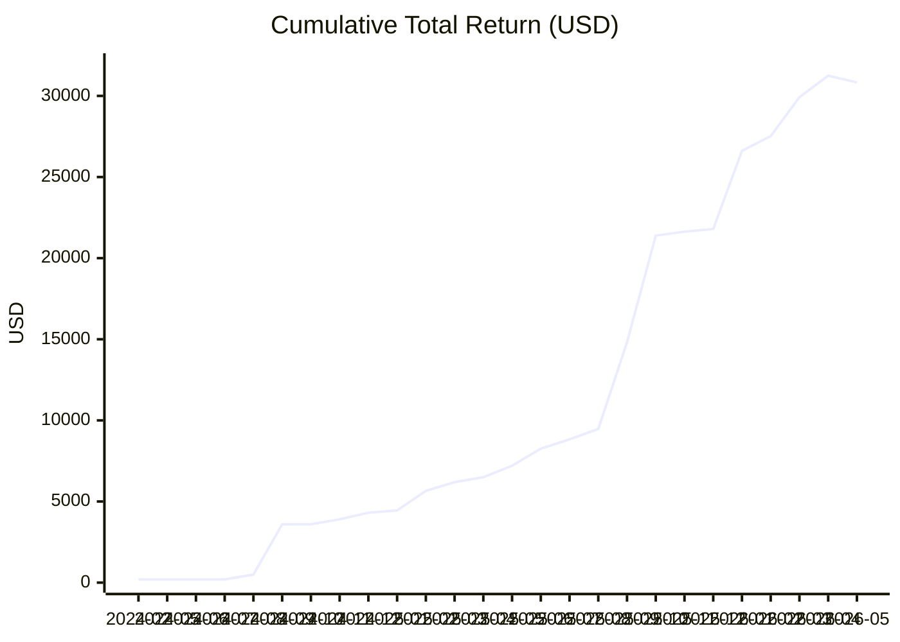

# IRA Performance Summary

**Analysis period:** 2024-02-15 to 2026-05-12 (monthly view: 2024-02 to 2026-05)

This summary is based on [IRA-performance.csv](IRA-performance.csv) and [ira-dividends.csv](ira-dividends.csv).

The trading section covers closed positions only. The income section adds cash distributions recorded in the dividends file, including SPAXX cash distributions.

## Scope and Method
- Source: closed-position rows from the IRA export.
- All numbers below are realized results only.
- The CSV appears to be lot-based, so win/loss counts are row-based, not strategy-based.
- Option and equity results are both included.

## Headline Results
| Metric                 |       Value |
| ---------------------- | ----------: |
| Closed rows analyzed   |         209 |
| Unique tickers         |          24 |
| Total cost basis       | $583,539.28 |
| Total proceeds         | $610,205.41 |
| Net realized gain/loss |  $26,666.13 |
| Winning rows           |         153 |
| Losing rows            |          51 |
| Flat rows              |           5 |
| Win rate               |       75.0% |
| Average winning row    |     $191.67 |
| Average losing row     |     -$52.14 |

Estimated realized return on cost basis: about 4.57%.

## Dividend and Cash Income Overlay
| Metric                                                |      Value |
| ----------------------------------------------------- | ---------: |
| Total dividend/cash distributions                     |  $4,166.07 |
| Of which SPAXX                                        |    $540.04 |
| Of which non-SPAXX dividends                          |  $3,626.03 |
| Combined realized trading gains + all distributions   | $30,832.20 |
| Combined realized trading gains + non-SPAXX dividends | $30,292.16 |

The SPAXX line should be treated as cash-yield income, not operating portfolio dividend income. It still matters economically, but it is different from dividends generated by the traded positions.

## Monthly Income by Month
This table reflects positive cash distributions from [ira-dividends.csv](ira-dividends.csv).

| Month   |  Income |
| ------- | ------: |
| 2024-05 |   $0.01 |
| 2024-06 |   $0.01 |
| 2024-07 |   $0.01 |
| 2024-08 | $304.96 |
| 2024-09 |   $0.01 |
| 2024-10 |   $1.66 |
| 2024-11 | $316.90 |
| 2024-12 | $360.04 |
| 2025-01 | $140.90 |
| 2025-02 | $135.59 |
| 2025-03 | $340.14 |
| 2025-04 | $233.99 |
| 2025-05 | $258.62 |
| 2025-06 | $382.55 |
| 2025-07 |  $99.72 |
| 2025-08 |  $73.00 |
| 2025-09 | $709.78 |
| 2025-10 |  $55.44 |
| 2025-11 |   $0.41 |
| 2025-12 |   $1.58 |
| 2026-01 |  $63.22 |
| 2026-02 |  $90.67 |
| 2026-03 |   $1.80 |
| 2026-04 | $595.06 |

Average monthly distribution across the full period shown: about $173.59.

## Breadth of Results
- 22 of 24 tickers were net profitable.
- Only 2 tickers were net negative: VPU and PFE.
- This supports the idea that the account has been broadly profitable across names, not just incidentally green in a few isolated trades.

## By Asset Type
| Asset type | Rows | Net realized P/L |
| ---------- | ---: | ---------------: |
| Equity/ETF |  141 |       $18,067.83 |
| Option     |   68 |        $8,598.30 |

Options contributed about 32.2% of realized gains, while equities and ETFs contributed about 67.8%.

## Biggest Contributors
### Top Net Winners by Ticker
| Ticker | Rows | Net realized P/L |
| ------ | ---: | ---------------: |
| INTC   |   60 |       $19,693.89 |
| BTI    |    6 |        $3,093.31 |
| HPE    |    3 |          $887.19 |
| ARCC   |    9 |          $866.53 |
| SMCI   |    2 |          $381.93 |
| KMI    |    7 |          $362.61 |
| F      |   25 |          $235.47 |
| CRCL   |    3 |          $198.70 |
| DRIV   |    4 |          $196.15 |
| OBDC   |    5 |          $169.28 |

### Net Losing Tickers
| Ticker | Rows | Net realized P/L |
| ------ | ---: | ---------------: |
| VPU    |    3 |         -$109.91 |
| PFE    |    3 |           -$8.10 |

## Dividend Contributors
| Symbol | Distribution income |
| ------ | ------------------: |
| AGNC   |           $2,203.33 |
| BTI    |             $619.93 |
| SPAXX  |             $540.04 |
| F      |             $503.96 |
| ARCC   |             $222.62 |
| DOC    |              $53.20 |
| ESOA   |              $22.99 |

AGNC was the dominant income generator in the dividends file, accounting for more than half of all non-SPAXX distributions.

## Final Return and Income Summary
This section combines closed-position trading gains with dividend and distribution income for a full realized picture by ticker.

| Symbol | Trading P/L |    Income | Total Realized Contribution |
| ------ | ----------: | --------: | --------------------------: |
| INTC   |  $19,693.89 |     $0.00 |                  $19,693.89 |
| BTI    |   $3,093.31 |   $619.93 |                   $3,713.24 |
| AGNC   |      $80.07 | $2,203.33 |                   $2,283.40 |
| ARCC   |     $866.53 |   $222.62 |                   $1,089.15 |
| HPE    |     $887.19 |     $0.00 |                     $887.19 |
| F      |     $235.47 |   $503.96 |                     $739.43 |
| SPAXX  |       $0.00 |   $540.04 |                     $540.04 |
| SMCI   |     $381.93 |     $0.00 |                     $381.93 |
| KMI    |     $362.61 |     $0.00 |                     $362.61 |
| CRCL   |     $198.70 |     $0.00 |                     $198.70 |
| DRIV   |     $196.15 |     $0.00 |                     $196.15 |
| OBDC   |     $169.28 |     $0.00 |                     $169.28 |
| ESOA   |     $108.36 |    $22.99 |                     $131.35 |
| DOC    |      $69.22 |    $53.20 |                     $122.42 |
| CPB    |      $81.00 |     $0.00 |                      $81.00 |
| BBW    |      $68.34 |     $0.00 |                      $68.34 |
| SOFI   |      $63.62 |     $0.00 |                      $63.62 |
| DOW    |      $62.92 |     $0.00 |                      $62.92 |
| ABR    |      $53.18 |     $0.00 |                      $53.18 |
| VTSI   |      $33.75 |     $0.00 |                      $33.75 |
| RIVN   |      $31.98 |     $0.00 |                      $31.98 |
| UPWK   |      $24.72 |     $0.00 |                      $24.72 |
| BAC    |      $21.92 |     $0.00 |                      $21.92 |
| PFE    |      -$8.10 |     $0.00 |                      -$8.10 |
| VPU    |    -$109.91 |     $0.00 |                    -$109.91 |

### All-In Totals
| Metric                               |      Value |
| ------------------------------------ | ---------: |
| Total trading P/L                    | $26,666.13 |
| Total dividend/distribution income   |  $4,166.07 |
| Final realized return + income total | $30,832.20 |
| Final realized total excluding SPAXX | $30,292.16 |

## Total Return Graph (Dollars)
This graph shows cumulative all-in realized return in dollars by month (trading P/L + dividends/distributions).

Latest cumulative all-in realized total: **$30,832.20**.

### Final Narrative
On an all-in realized basis, the IRA has generated $30,832.20 from closed trading plus dividends and distributions. That is the cleanest single-number summary of performance from the files currently provided.

The combined picture confirms three things. First, the account is clearly profitable. Second, the process is not purely dependent on price appreciation because distributions add meaningful cash income on top of trading gains. Third, the result is still concentrated: INTC is the dominant trading contributor, while AGNC is the dominant portfolio income contributor and SPAXX adds a smaller but still relevant cash-yield layer.

If SPAXX is excluded to focus only on portfolio positions, the combined total is still $30,292.16, which means the strategy remains strongly positive even without counting cash-sweep yield.

## Largest Single Closed-Row Outcomes
| Type           | Ticker | Net realized P/L |
| -------------- | ------ | ---------------: |
| Largest winner | BTI    |        $2,430.58 |
| Largest loser  | AGNC   |         -$565.33 |

## Overall Picture
The overall picture is strong. On a realized basis, the IRA shows solid profitability, a high win rate, and broad success across the ticker universe. The average winning closed row was materially larger than the average losing row, which is exactly what a durable trading process should produce.

Once dividends and cash distributions are included, the picture improves further. Closed-position trading gains were $26,666.13, and the dividends file adds another $4,166.07 of realized cash income, bringing the combined total to $30,832.20. Even if SPAXX is excluded as cash-yield income rather than portfolio dividend income, the combined result is still $30,292.16.

The main caution is concentration of gains. INTC alone generated $19,693.89, which is about 73.9% of total realized profits. That means the account was not just profitable, but also heavily dependent on one standout name. That is not necessarily bad, but it does mean the aggregate result looks much stronger because one ticker worked exceptionally well.

There is a similar concentration pattern in the income stream. AGNC produced $2,203.33 of distributions, making it the main income engine in the dividends file. That reinforces the point that the account has been profitable and income-generative, but some of that strength is being carried by a small number of outsized contributors.

Even after removing INTC, the account would still be up about $6,972.24 on closed positions, which is an important sanity check. It suggests the process is still positive outside the single biggest winner.

## Interpretation
- The realized record supports that your closed trading has been working.
- The breadth is better than it might feel emotionally: 22 of 24 tickers finished net positive.
- Options are adding meaningful value, but the majority of realized gains still came from underlying equity/ETF trades.
- Dividends and cash distributions materially strengthen the total IRA result and show that income generation is a real part of the process, not just price appreciation.
- Losses appear controlled at the row level, with average losses much smaller than average wins.
- The main portfolio-level issue is concentration, not lack of profitability.

## Practical Takeaways
1. The trading process appears profitable on closed positions alone, and more profitable once dividends are layered in.
2. Emotional experience may understate actual results, especially if you focus on uncomfortable periods inside otherwise profitable trades.
3. Position concentration should still be watched closely, because one major winner is carrying a large share of the total outcome.
4. Income quality matters: separate portfolio dividends from SPAXX cash yield so the core strategy is measured cleanly.
5. Monthly income is uneven, but the account is clearly producing realized cash flow in addition to trading profits.
